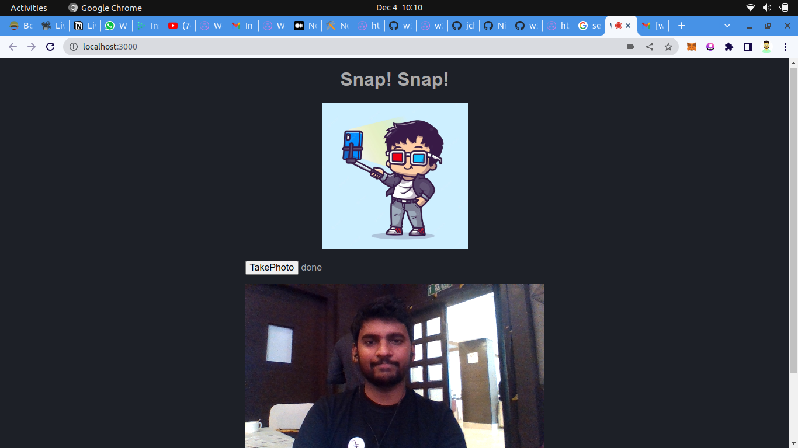

# Snap! Snap ! is a project which uses w3 upload api to store your cute selfies onto web3.storage

Prerequisites:
Install web3.storage cli by using the below command 
```sh
    npm install -g @web3-storage/w3up-cli 
    w3up id
    w3up register register  your@email.com
    w3up whoami
```

  

- Install dependencies and start:

  ```sh
  npm install
  npm start
  ```


